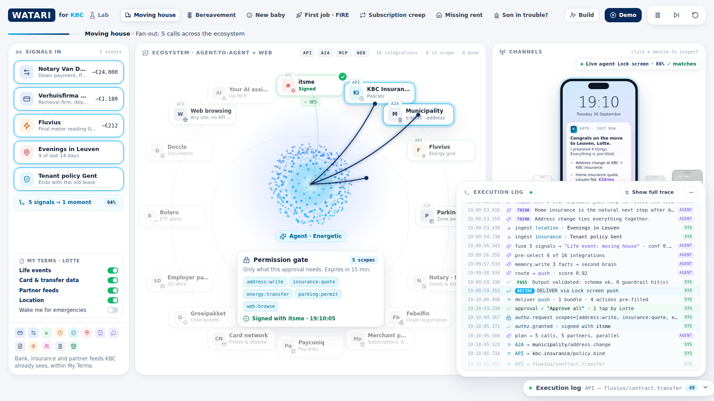
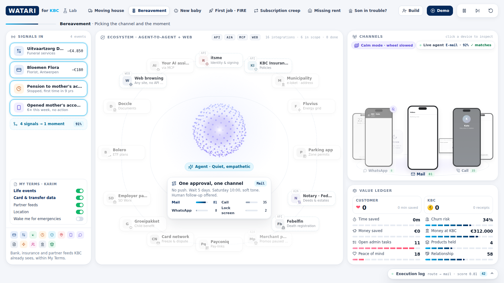
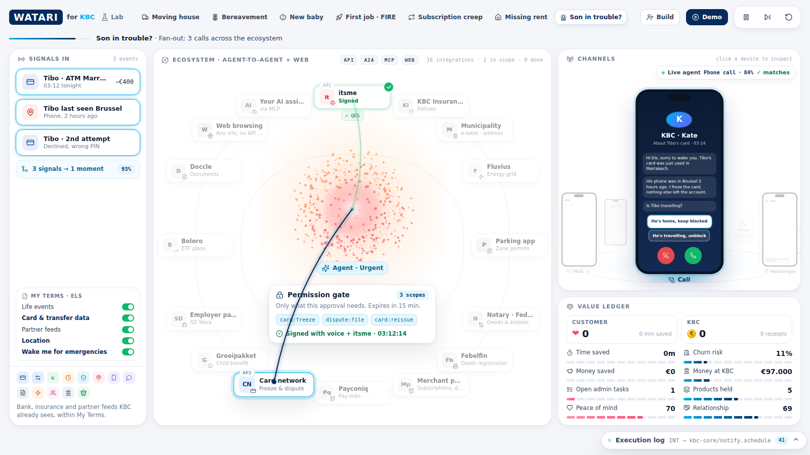
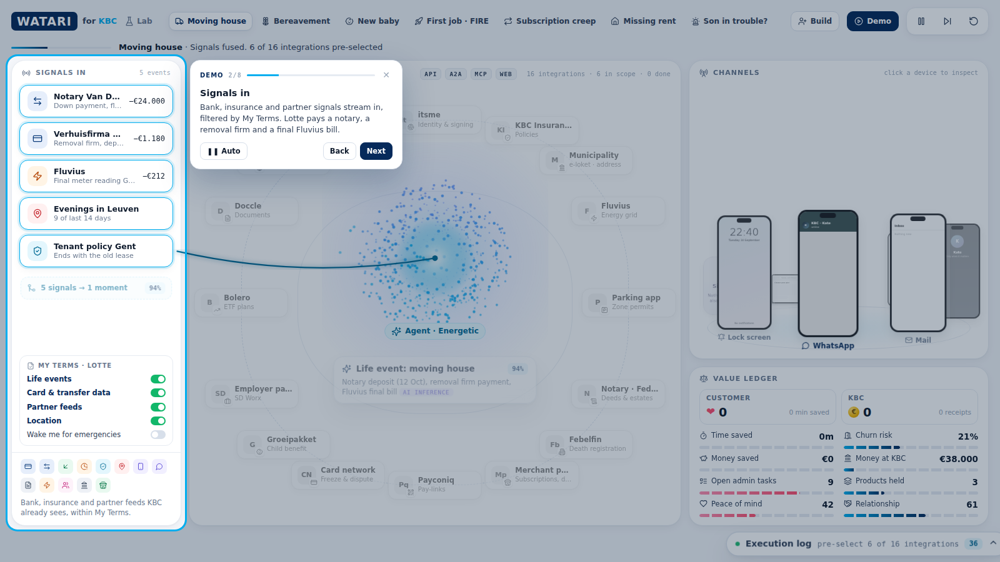
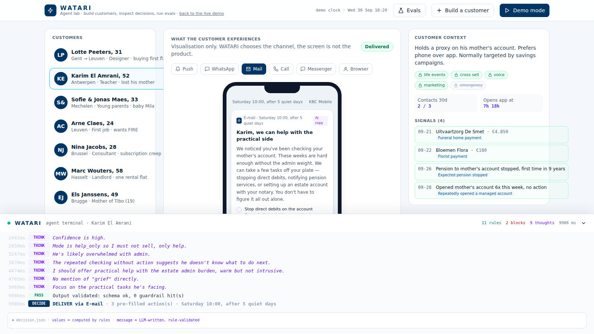

# WATARI · moment engine for KBC

> KBC answers 80 million questions. WATARI answers the ones customers never had to ask, and knows when to stay quiet.

**Live demo: https://watari-indol.vercel.app**  ·  Agent lab: https://watari-indol.vercel.app/lab  ·  Evals: https://watari-indol.vercel.app/api/evals

Tectonic Hackathon 2026, KBC track. Everything runs on **synthetic data**, with no real customers and no real KBC systems.



## The idea
Kill the app. Customers shouldn't have to ask good questions: an agent should bring good answers at the right moment, on the right channel, or stay silent.

WATARI sits between the signals KBC already sees (bank, insurance, app, partners) and every channel (push, WhatsApp, mail, call, Messenger, browser). For every customer it:

1. **Understands**: fuses signals into one life moment, with a confidence score
2. **Adapts**: checks consent, sensitivity, fatigue and Quiet Hours, then picks the channel and timing, or decides to stay silent
3. **Acts**: sends one pre-filled bundle that the customer approves with one tap, after which the admin gets done across the ecosystem

The screens are only a window on the agent. The product is the agent, and the **execution log** (press `L`) shows it thinking live.

## What to try
| Where | What you see |
|---|---|
| `/` | 7 stories (moving, bereavement, baby, first job, subscriptions, missing rent, son in trouble). Each tab also runs the **real agent** on the server and streams its trace into the log. The chip top-right shows the live verdict |
| **Demo** button | 60-second guided tour (starts on the first visit) |
| **Build** / `/lab` | Create your own customer with any signals, including free text or a prompt-injection attempt, and watch the same agent decide |
| **Evals** (in lab) | 17 behavioural tests: the 7 stories, perturbations, unseen customers and safety cases |

| Bereavement: calm mode, promos muted, mail after 5 quiet days | 03:12 card fraud: Quiet Hours broken, with consent |
|---|---|
|  |  |

| Demo mode | Agent lab with streamed reasoning |
|---|---|
|  |  |

## How the agent decides
| Step | Decided by |
|---|---|
| Consent gate (My Terms), GDPR Art. 9 exclusion (health, union), 45-day lookback | Rules |
| Life moment + confidence (noisy-OR evidence fusion, threshold 0.6) | Rules |
| Sensitivity mode: help-only (grief, promos muted 30d), confirm-first (baby), emergency | Rules |
| Fatigue cap (3 contacts / 30 days), Quiet Hours 22-07 (broken only for emergencies with consent), financial stress (no credit) | Rules |
| Channel = customer preference × fit for the moment (browser only if the customer is at a checkout right now) | Rules |
| Product allowlist + eligibility (no owned products, no commercial items without consent) | Rules |
| Free-text signal → category | LLM (Claude), validated against a closed list |
| Message copy + reasoning | LLM (Claude), schema-validated, allowlist re-checked |

The LLM never overrides a rule. If it fails, or no key is set, WATARI falls back to template copy and makes the same decision.

## Stack
Next.js 15 on Vercel · Claude API (Anthropic SDK, streaming) · Neon Postgres for custom customers and run logs (optional, falls back to memory) · zod · Tailwind · vanilla JS wireframe (`public/w`)

## Run locally
```bash
npm install
cp .env.example .env.local   # ANTHROPIC_API_KEY (optional), DATABASE_URL (optional)
npm run dev                  # http://localhost:3000
```

## Security
- Keys live only in server env vars and never reach the browser. `.env*` is git-ignored
- Strict zod schemas with length caps and enums. IDs are regex-checked
- Signal text goes to the LLM as data. Output categories and products are checked against closed allowlists (see the prompt-injection preset in the lab)
- Per-IP rate limits on every API route. CSP, HSTS, X-Frame-Options DENY, nosniff, Referrer-Policy, Permissions-Policy
- Parameterised SQL only

## Unfinished
- Partner calls in the wireframe (itsme, Fluvius, Febelfin...) are simulated. The decision layer is real
- Voice call isn't placed. The 100k-customer "Mirror Belgium" scale run isn't in this build
- Rate limiting is per instance (in memory). Production would use Redis
